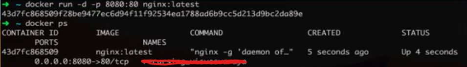
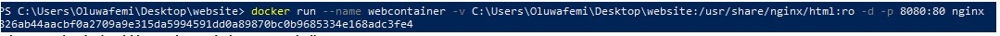

docker pull nginx:latest
###### run the below docker images cmd to check your list of images 
docker images
###### Now we run the below code to create our container off the images
docker run -d nginx:latest 
docker container ls
##### Now we map our local host port 8080 to the Nginx port 80
docker stop containerID
docker run -d -p 8080:80 nginx:latest

 go to your browser and type localhost:8080, you should see an NGINX welcome page

 ##### Before i forget, i forced removed the container and ran it with a new container name
 docker run --name webcontainer -d -p 8080:80 nginx:latest

 

 ##### Now to begin the process of mounting the volume, lets create a simple index.html page in a folder named website and save it
 <h3> hello docker and volumes </h3>

 ##### Now lets delete the container again and write the below cmd to mount the volume on both the host&container.
  <h2> docker run --name webcontainer -v C:\Users\Oluwafemi\desktop\website:/usr/share/nginx/html:ro -d -p 8080:80 nginx <h2>

##### WHat we have done with the cmd above is to map both the website folder to the html. If you do an ls on the container 'html',
you will get the same value on when you do ls on the website folder. ANy change you make on the host will replicate in the container. Please also note only that particular cmd was done on windows powershell. You might have a little challenge doing this on gitbash or wsl.

##### The below cmd works for mac Users
docker run --name webcontainer $ -v $(pwd):/usr/share/nginx/html -d -p 8080:80 nginx

##### To enter your container server and verify the information there, run the below. You will find out whatever is on the container is the same in the website folder
Docker exec -it webcontainer bash
